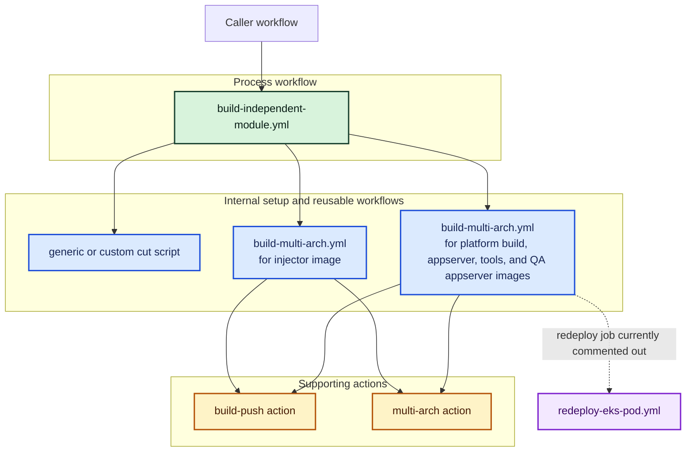

# Build Independent Module Workflow Visuals

## Scope

This document shows the visual overview and top-level architecture for `devops-engineering-ci-public-build-independent-module-workflow/.github/workflows/build-independent-module.yml`.

## Visual overview

## Top-level architecture

