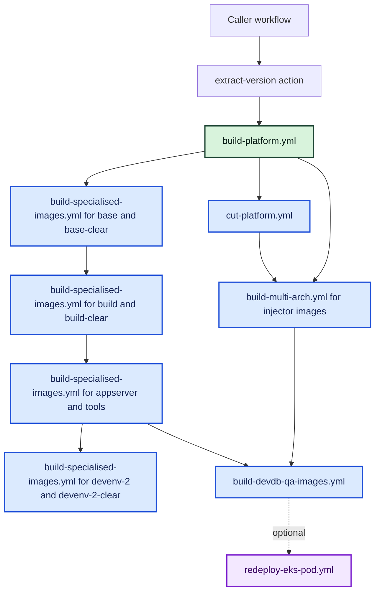
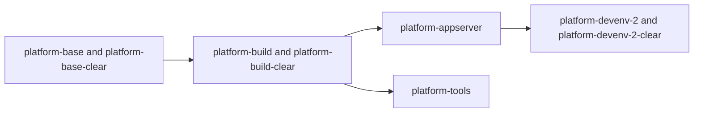
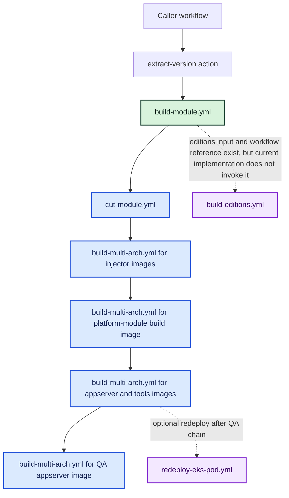
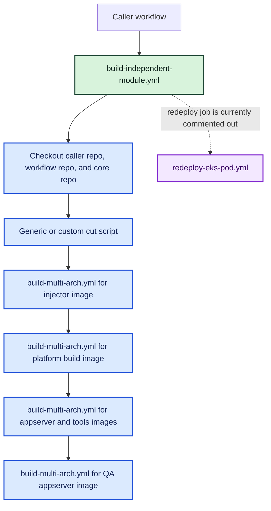
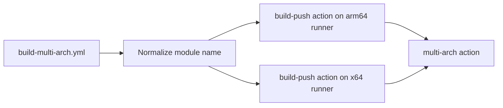
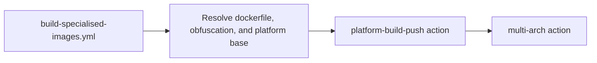
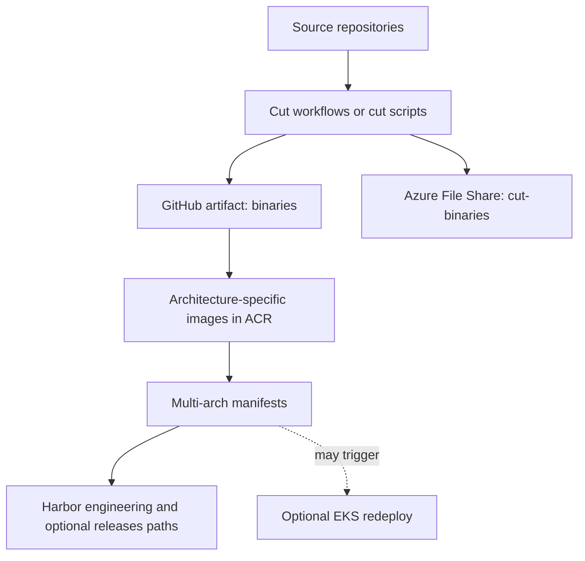

# Build Paths

## Platform Build Path

### Platform workflow dependency detail

## Standard Module Build Path

## Independent Module Build Path

## Shared Multi-Arch Build Path

## Specialised Platform Image Build Path

## Build Output Flow

