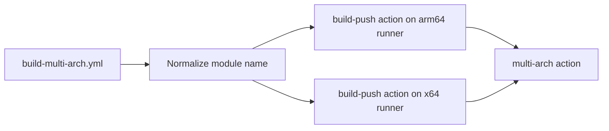
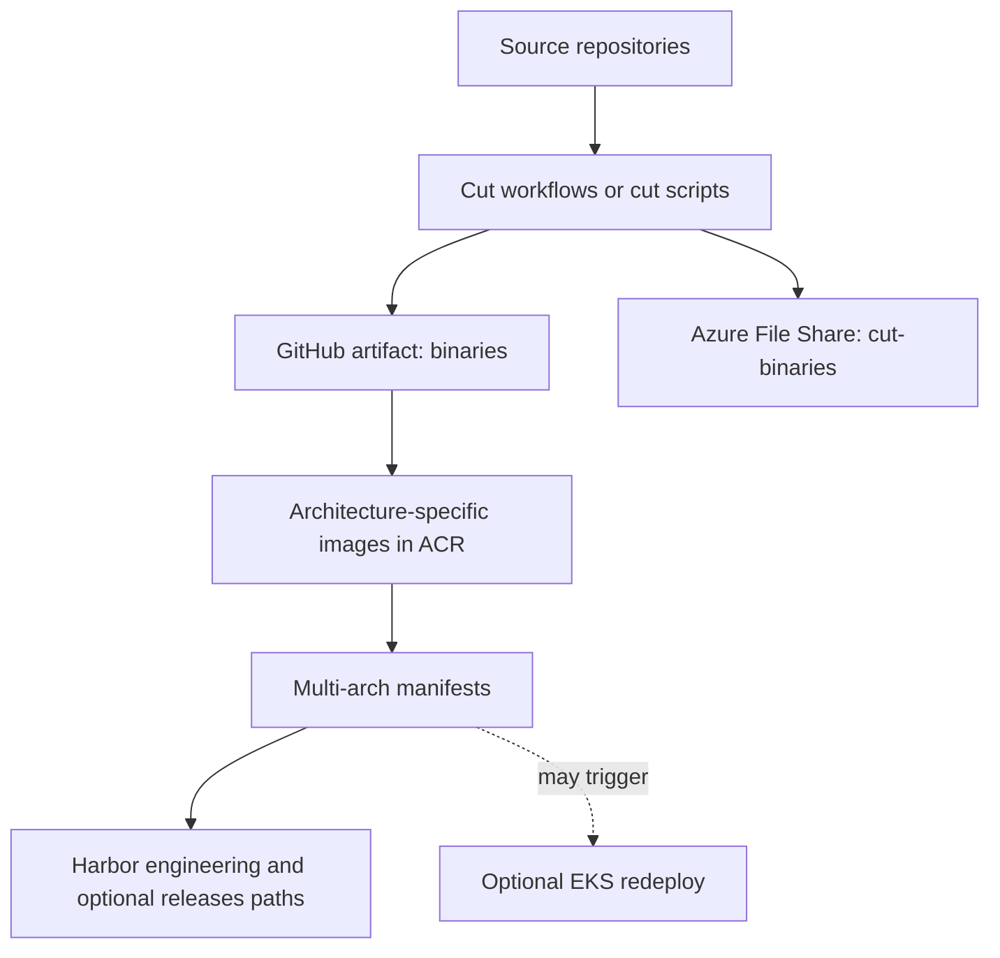

# Build Paths

This file now contains the shared build-component diagrams used by multiple process workflows.

For the process-specific visuals, use:

- [BUILD-PLATFORM-WORKFLOW.md](./BUILD-PLATFORM-WORKFLOW.md)
- [BUILD-MODULE-WORKFLOW.md](./BUILD-MODULE-WORKFLOW.md)
- [BUILD-INDEPENDENT-MODULE-WORKFLOW.md](./BUILD-INDEPENDENT-MODULE-WORKFLOW.md)

## Shared Multi-Arch Build Path

## Specialised Platform Image Build Path

## Build Output Flow

