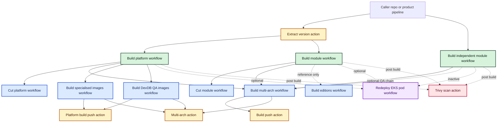
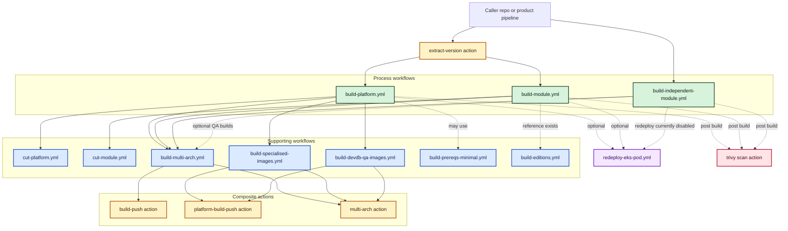

# Repository Map

## Legend

- Process workflows are the main reusable entry points.
- Supporting workflows are called by the process workflows.
- Composite actions perform the low-level build, tagging, and manifest work.
- Deployment and scanning sit adjacent to the build path.

## Repository Map

| Repository | Type | Main entrypoint | Primary role |
| --- | --- | --- | --- |
| `devops-engineering-ci-public-build-platform-workflow` | Process workflow repo | `.github/workflows/build-platform.yml` | Orchestrates platform builds |
| `devops-engineering-ci-public-build-module-workflow` | Process workflow repo | `.github/workflows/build-module.yml` | Orchestrates standard module builds |
| `devops-engineering-ci-public-build-independent-module-workflow` | Process workflow repo | `.github/workflows/build-independent-module.yml` | Orchestrates independently versioned module builds |
| `devops-engineering-ci-public-build-multi-arch-workflow` | Supporting workflow repo | `.github/workflows/build-multi-arch.yml` | Builds amd64 and arm64 images, then publishes a manifest |
| `devops-engineering-ci-public-build-platform-specialised-image-workflow` | Supporting workflow repo | `.github/workflows/build-specialised-images.yml` | Builds specialised platform image families |
| `devops-engineering-ci-public-build-platform-specialised-image-workflow` | Supporting workflow repo | `.github/workflows/build-devdb-qa-images.yml` | Builds DevDB QA image families |
| `devops-engineering-ci-public-build-platform-workflow` | Supporting workflow repo | `.github/workflows/cut-platform.yml` | Produces platform cut artifacts |
| `devops-engineering-ci-public-build-platform-workflow` | Supporting workflow repo | `.github/workflows/build-prereqs-minimal.yml` | Builds minimal multi-arch pre-req images |
| `devops-engineering-ci-public-build-module-workflow` | Supporting workflow repo | `.github/workflows/cut-module.yml` | Produces standard module cut artifacts |
| `devops-engineering-ci-public-editions-workflow` | Supporting workflow repo | `.github/workflows/build-editions.yml` | Builds edition image families via the shared multi-arch flow |
| `devops-engineering-ci-public-extract-version-action` | Composite action repo | `action.yml` | Normalizes version and tags before build |
| `devops-engineering-ci-public-build-push-action` | Composite action repo | `action.yml` | Builds one module-style architecture-specific image |
| `devops-engineering-ci-public-platform-build-push-action` | Composite action repo | `action.yml` | Builds one platform architecture-specific image |
| `devops-engineering-ci-public-multi-arch-action` | Composite action repo | `action.yml` | Creates and retags multi-arch manifests |
| `devops-engineering-ci-redeploy-eks-pod` | Deployment workflow repo | `.github/workflows/redeploy-eks-pod.yml` | Forces pod rollout on EKS |
| `devops-engineering-ci-public-trivy-scan-action` | Scanning repo | not present in current snapshot | Intended post-build image scanning |

## Visual overview

## Top-Level Architecture

## Notes On Current Gaps

- `devops-engineering-ci-public-trivy-scan-action` is represented as an adjacent component because the current workspace snapshot does not include its `action.yml`.
- `devops-engineering-ci-public-build-module-workflow` exposes an editions-related input and reference, but the current workflow implementation does not invoke the editions workflow.
- `devops-engineering-ci-public-build-independent-module-workflow` contains a commented-out redeploy job, so the redeploy edge is shown as inactive.